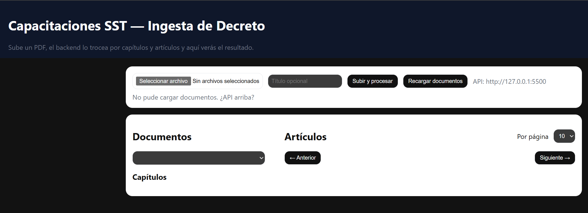
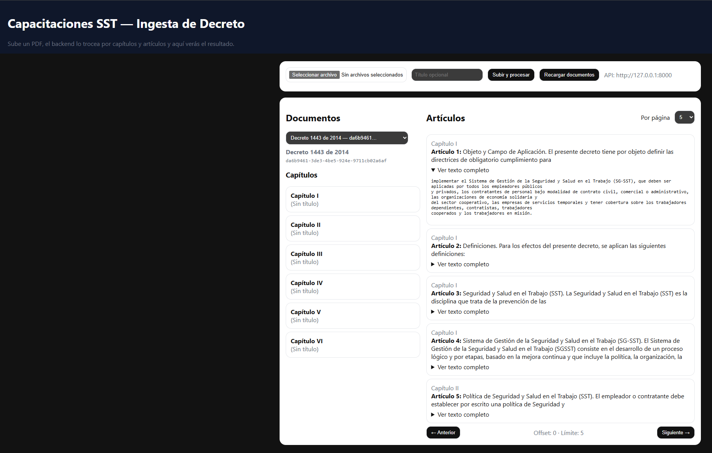

# Hackathon LegalTech - Ingesta de Decretos SST
Publicacion: https://www.instagram.com/p/DQ60GCtgUN0/?img_index=10
Prototipo funcional desarrollado durante un hackathon multidisciplinario de derecho. El sistema permite cargar un decreto en formato PDF, procesar su contenido automáticamente y visualizarlo de forma estructurada por documentos, capítulos y artículos.

El objetivo técnico del prototipo fue convertir normativa extensa de Seguridad y Salud en el Trabajo (SST) en contenido navegable, dejando la base preparada para futuras funcionalidades de capacitación interna, seguimiento de avance, evaluaciones, alertas y certificados.

## ¿Qué hace el software?

La aplicación permite:

* Subir un documento PDF desde una interfaz web.
* Enviar el archivo al backend para su procesamiento.
* Extraer automáticamente el texto del PDF.
* Limpiar encabezados, pies de página y saltos innecesarios.
* Detectar capítulos del decreto.
* Detectar artículos del decreto.
* Guardar los documentos, capítulos y artículos en una base de datos SQLite.
* Consultar el contenido procesado desde una interfaz web.
* Navegar artículos de forma paginada.
* Desplegar el texto completo de cada artículo.

## Flujo general

```txt
PDF del decreto
    ↓
Carga desde la interfaz web
    ↓
Backend FastAPI
    ↓
Extracción de texto con PyMuPDF
    ↓
Limpieza y normalización del contenido
    ↓
Detección de capítulos y artículos
    ↓
Almacenamiento en SQLite
    ↓
Consulta desde la interfaz web
```

## Capturas de pantalla

### Pantalla inicial



### Documento procesado



## Tecnologías utilizadas

* Python
* FastAPI
* PyMuPDF
* SQLite
* HTML
* CSS
* JavaScript
* API REST

## Estructura del proyecto

```txt
.
├── main.py
├── ingest.py
├── requirements.txt
├── README.md
├── web/
│   └── index.html
└── docs/
    └── screenshots/
        ├── 01-home.png
        └── 02-document-processed.png
```

## Instalación y ejecución local

### 1. Clonar el repositorio

```bash
git clone https://github.com/brian97dias/hackathon-legaltech.git
cd hackathon-legaltech/proyecto
```

### 2. Crear entorno virtual

```bash
python -m venv .venv
```

### 3. Activar entorno virtual

En Windows PowerShell:

```bash
.venv\Scripts\activate
```

### 4. Instalar dependencias

```bash
python -m pip install -r requirements.txt
```

### 5. Ejecutar el backend

```bash
python -m uvicorn main:app --reload --host 127.0.0.1 --port 8000
```

### 6. Abrir la aplicación

Opción recomendada:

```txt
http://127.0.0.1:8000/ui/
```

También se puede abrir el frontend con Live Server en VS Code y apuntarlo manualmente al backend:

```txt
http://127.0.0.1:5500/web/index.html?api=http://127.0.0.1:8000
```

## Verificar que la API esté activa

```txt
http://127.0.0.1:8000/health
```

Respuesta esperada:

```json
{
  "status": "up"
}
```

## Endpoints principales

```txt
GET  /health
POST /upload-pdf
GET  /documents
GET  /documents/{doc_id}/chapters
GET  /documents/{doc_id}/articles
GET  /documents/{doc_id}/articles/{number}
```

## Alcance del prototipo

Este proyecto implementa el módulo base de ingesta y estructuración normativa. No es una plataforma completa de capacitación, pero deja preparada la información para construir funcionalidades posteriores como:

* Microcapacitaciones basadas en artículos del decreto.
* Generación de preguntas por tema.
* Evaluaciones para empleados.
* Seguimiento del avance de capacitación.
* Alertas de cumplimiento normativo.
* Certificados automáticos.
* Panel administrativo para empresas.

## Estado del proyecto

Prototipo funcional desarrollado para hackathon.
El sistema permite cargar, procesar, almacenar y visualizar decretos SST estructurados por capítulos y artículos.

## Mi rol

Desarrollé el backend del prototipo, incluyendo la carga de archivos PDF, extracción y limpieza de texto, detección automática de capítulos y artículos, persistencia en SQLite y exposición de endpoints REST consumidos por una interfaz web.
